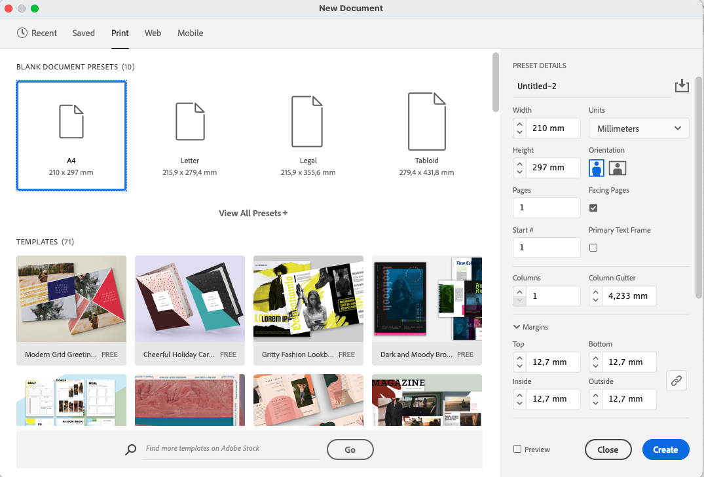
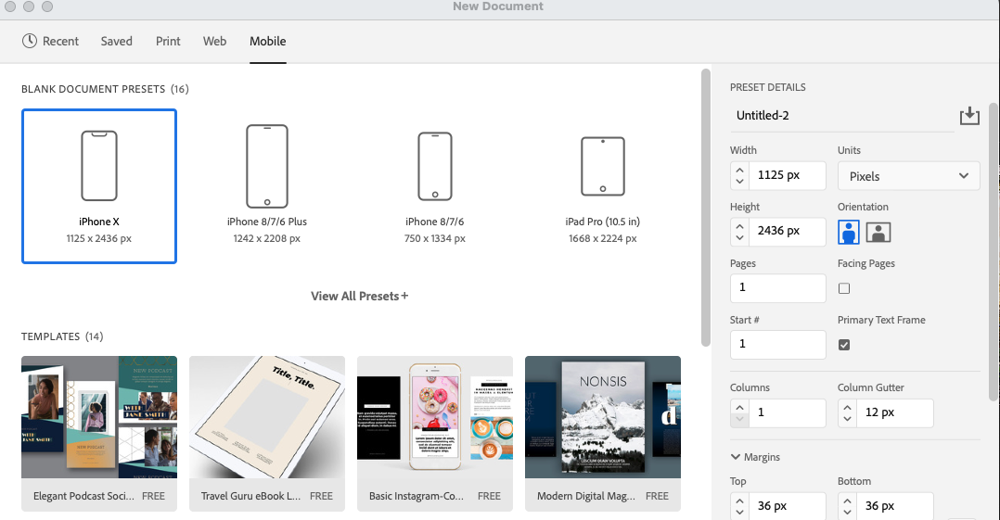

# PEC3: Visionando el futuro con las gafas de Manovich: redescubriendo la hibridación

Autor: Toni Melián Hernández  
email: tonimelian@uoc.edu  
Fecha: 25.05.2023

 

Siguiendo con las prácticas de la UOC, a continuación presentaré dos casos de hibridación según Lev Manovich

**Adobe Indesign**. Se trata de un software que nace en un principio para la autoedición en la impresión profesional (fundamentalmente impresión offset) y con el tiempo ha desarrollado compatibilidad con otros formatos de publicación digital, como EPUB y HTML. De esta forma actualmente se puede crear contenidos con Adobe Indesign que puede ser exportado en varios formatos digitales, adaptados a diferentes dispositivos (pantallas, móviles, tablets).

**WordPress (WP)**. Wordpress, es un sistema de gestor de contenidos (CMS) de código abierto, que en un principio apareció como plataforma de blog. Con el paso del tiempo WP ha ido evolucionando y añadiendo nuevas funcionalidades, trabajando con contenido estático y dinámico, integrándose con otras herramientas de software para ampliar su funcionalidad (a través de plugins), permitiendo crear una amplia grama de sitios webs, desde plataformas de comercio electrónico hasta medios de comunicación.

## Planteamiento

Para esta práctica, he decido usar como ejemplos de hibridación, según Lev Manovich, dos software que conozco y utilizo desde su primera aparición en el mercado y en la comunidad (hace ya casi 20 años) y que son Adobe Indesign y WordPress. 

De una forma muy resumida, que extenderé en los siguientes apartados, puedo dar una primera descripción de los mismos como: 
* **Adobe Indesign**, es el programa específico para la maquetación profesional de documentos de la familia de Adobe Creative Suite.
* **WordPress**, es un gestor de contenidos (CMS, Content Management System) de código abierto, utilizado ampliamente para la creación de páginas webs.

Según Lev Manovich, y de una forma muy esquemática, **la hibridación** es el proceso de combinar diversos elementos o influencias de diferentes fuentes o contextos culturales para crear algo nuevo. Implica la convergencia de medios, géneros o estilos diferentes, que da como resultado la creación de formas o entidades híbridas que fusionan elementos previamente distintos.

Me resulta personalmente interesante analizar estos software desde la perspectiva de Lev Manovich y poder identificar como su evolución y desarrollo en el tiempo, incorporando nuevas funcionalidades y características, ha ido generando un proceso de hibridación, a diferentes niveles, hasta convertirse en lo que son en la actualidad.

## Re-descubriendo la hibridacion: Adobe Indesign

***Adobe InDesign*** es un software para la composición digital de páginas, desarrollado por la compañía *Adobe Systems*, que permite a los usuarios crear materiales impresos y digitales profesionales, como folletos, revistas y libros.

Me gustaría mencionar brevemente, que en la práctica anterior (PAC 02) analicé las características de *Adobe Indesign* desde el punto de vista de la **transcodificación** y **remediación** ([enlacen a la práctica](https://view.genial.ly/6446d7ee8938a7001318cdf8/presentation-uoc-pac02) ) y a continuación presentaré el análisis desde el punto de vista de la hibridación, de esta forma se puede entender claramente las diferencias entre estos conceptos de acuerdo Lev Manovich.

La **composición digital de páginas** o **maquetación** es la distribución de los elementos (tales como el texto y las imágenes) en un espacio determinado, que en el caso que nos ocupa, sería básicamente en las páginas de medios impresos y electrónicos. 

En un principio *Adobe Indesign* aparece como un nuevo software para hacer la competencia al software profesional estándar utilizado en aquel momento, que era **QuarkXpress** y ganarle así su cuota de mercado. En aquellos primeros momentos los dos software eran utilizados para la **maquetación profesional** orientada a la impresión profesional, tanto **digital** como ***offset***(cuadricomía) y ambos tenían características muy similares. De aquella “**batalla**”, salió como vencedor Adobe Indesign, no tanto por su superioridad técnica, sino por su precio y su integración con el resto de programas de la familia de Adobe.

Esta última característica mencionada, o sea, la **integración de Adobe Indesign con el resto de los herramientas del paquete de Adobe**, es precisamente un aspecto clave en la **hibridación** de *Adobe Indesign*. La ***Suite Adobe Creative Cloud*** está compuesta de diferentes herramientas como son *Adobe Photoshop, Adobe After Effects* o *Adobe Illustrator*, entre otras. Estas herramientas están diseñadas para funcionar de forma independiente, cada una dentro de su dominio de trabajo específico, pero también han evolucionado, para poder **trabajar juntas** sin problemas, lo que permite a los usuarios transferir archivos entre las aplicaciones y también utilizar funciones de cada herramienta para completar el trabajo en Adobe Indesign.

Desde su aparición, Adobe Indesign ha ido poco a poco adquiriendo **funciones de otros programas del paquete de Adobe**, como por ejemplo las herramientas de pluma, que permiten realizar dibujos o las opciones para fusionar objetos (unir, sustraer, intersección, etc.) propias originalmente del programa *Adobe Illustrator*, o las herramientas efectos (sombras, multiplicar, etc.) originarias de *Adobe Photoshop*. Estas nuevas funciones expanden las capacidades del programa, más allá de la maquetación profesional (para la cual estaba destinado), facilitando el trabajo y permitiendo realizar gran parte del trabajo con un único programa.

Otro aspecto de la **hibridación** de *InDesign* es como se ha adaptado a los diferentes **formatos de publicación digital**, tales como son ***EPUB*** y ***HTML***. Actualmente *InDesign* permite a los usuarios crear contenido que puede ser exportado a los formatos digitales mencionados, con lo que los diseñadores pueden crear publicaciones digitales que pueden ser **visualizadas** en **varios tipos de dispositivos**, como teléfonos móviles, tablets o pantallas de ordenador. Esta **compatibilidad con los nuevos formatos** de publicación digital están apoyados con nuevas funciones en el software que permite el trabajo con los mismos, tales como los *hiperlinks*, los botones y formularios, la incorporación de elementos multimedia (video), animaciones, etc.

En resumen, *Adobe InDesign* presenta **hibridación**, según Lev Manovich porque combina elementos de diseño de impresión tradicional con tecnologías digitales, permitiendo trabajar y exportar en formatos como *HTML* o *EPUB*, así como está diseñado para funcionar junto con otras herramientas de software de Adobe Creative Suite, que facilitan y expanden la publicación y el proceso de diseño.

Nuevo documento: plantillas para móviles

## Re-descubriendo la hibridacion: Wordpress

**WordPress (WP)** es un sistema de gestión de contenidos (*CMS, Content Management System*) que combina elementos de desarrollo web y plataformas de blogs. Los usuarios pueden utilizarlo para crear y administrar sitios webs utilizando una gran variedad de herramientas y funciones, además de plantillas y complementos.

**La aparición de WordPress se remonta al año 2003**, cuando el desarrollador Matt Mullenweg  se asocia con Mike Little para desarrollar una nueva herramienta de código abierto para la creación blogs, ya que las herramientas que existían en aquel momento habían dejado de estar operativas (b2/cafelog) o eran deficitarias. De esta forma se lanzó la primera versión de WordPress el 27 de mayo del 2003, **¡hace ya 20 años!**

El **objetivo inicial de WordPress** era hacer que los blogs fueran accesibles y agradables de usar. Desde un principio tuvo mucho éxito y con el tiempo va apareciendo una **fuerte comunidad** en torno suyo, permitiendo la creación de complementos expandiendo así las capacidades del software y convirtiéndose en un sistema de gestión de contenidos (*CMS*) completo.

Los usuarios pronto descubrimos (y me incluyo personalmente) que WP podía usarse no sólo para la creación de blogs, sino también para la creación de sitios webs profesionales. Actualmente, en el 2023, **WordPress ocupa la principal posición como CMS**, con una **cuota de mercado del 41,28%** (equivalente a unas 30,462,105 páginas webs activas), muy por encima de otras herramientas, según datos de [First Site Guide](https://firstsiteguide.com/cms-stats/).

### Referencias y Bibliografía

* Manovich, Lev. (2013). **El Software toma el mando**. Barcelona: Editorial UOC. 
* "El software toma el mando" Lev Manovich, 2013 (ePub)
"Remediación, multimedia e hibridación de los medios" (Multimedia UOC)
"Conocimiento Abierto y Tecnología" (Psicologiasocial)
"Hibridación de medios" (Wikipedia)
"Lev Manovich" (Wikipedia)
* Adobe InDesign, Wikipedia [Consulta 15/05/2023]. Disponible en: https://es.wikipedia.org/wiki/Adobe_InDesign
* WordPress, Wikipedia [Consulta 15/05/23]. Disponible en: https://en.wikipedia.org/wiki/WordPress
* Ferran Adell, Remediación, multimedia e hibridación de los medios [Consulta 15/05/2023]. Disponible en: http://multimedia.uoc.edu/blogs/fem/es/remediacio-multimedia-i-hibridacio-dels-mitjans/
----

Licencia: Material Creative Commons desarrollado bajo licencia CC BY-SA 4.0. 
Imágenes CC BY [Tubik studio](https://blog.tubikstudio.com/how-to-create-original-flat-illustrations-designers-tips/) 
